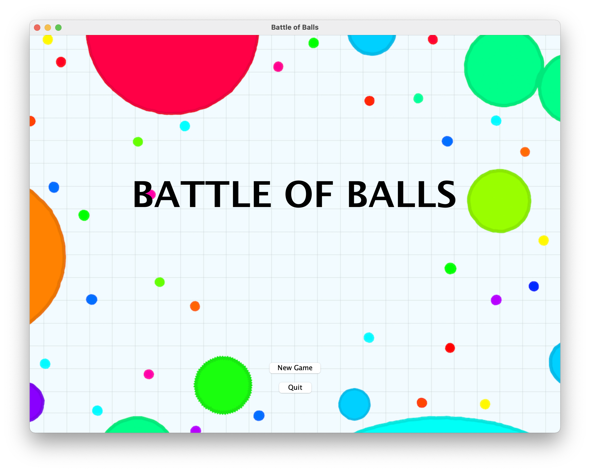
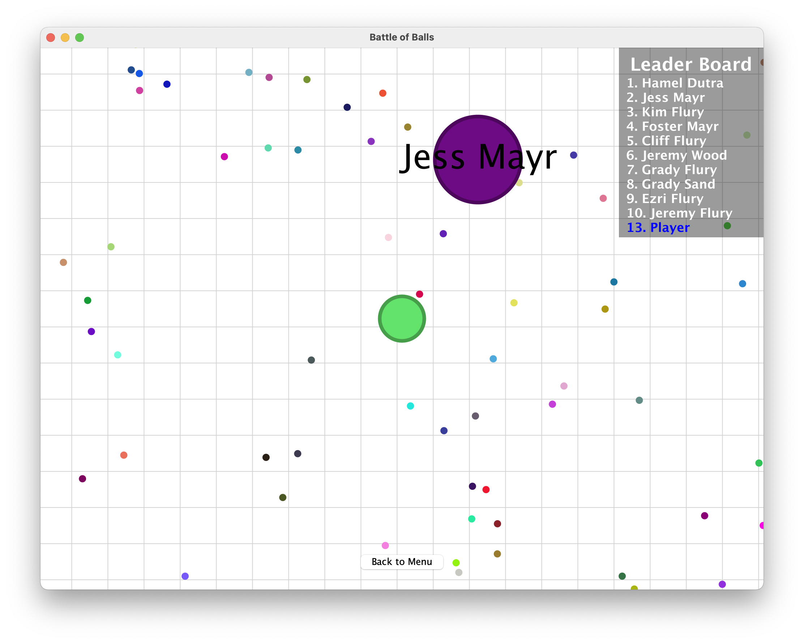

# Battle of Balls

## Team Members:
Joseph Shao, Eric Wang, Dennis Qin

## Project Summary:
In the game, players need to control their balls as they move around the map, eating up resources in the map to grow larger, in order to eat smaller balls and prevent themselves from being eaten by larger balls.
 

## Game Guide:
The player needs to use the arrow keys to move the balls around the map, eating circle resources and grow larger. The player can also eat smaller balls to prevent them from being eaten by larger balls.

**Start Menu:**

**MainGame UI:**

## Challenges:
The Collision between objects

The logic of map movement and boundary detection

Concurrent Modification Exception

