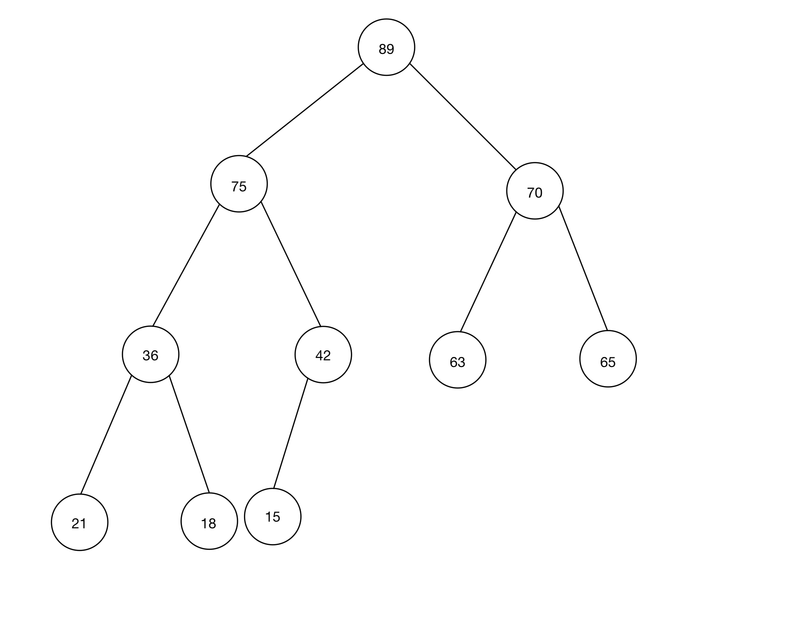

## COMP 128 Exam 3
**Eric Wang**

### LG6: Maps
```Java
import java.util.HashMap;
import java.util.List;
import java.util.Map;

public class SimpleTranslator {
    private Map<String, String> dictionary;

    public SimpleTranslator() {
        dictionary = new HashMap<>();
    }

    public void addTranslation(String word, String translation) {
        dictionary.put(word, translation);
    }

    public void translateWords(List<String> phrase) {
        StringBuilder sb = new StringBuilder();
        for (String word : phrase) {
            if (dictionary.containsKey(word)) {
                sb.append(dictionary.get(word));
                sb.append(" ");
            } else {
                sb.append(word);
                sb.append(" ");
            }
        }
        if (sb.length() > 0) {
            sb.deleteCharAt(sb.length() - 1);
            System.out.println(sb.toString());
        }
    }
}
```

### LG7: Trees
+ (a) All possible values: 42, 75, 89, 90
+ (b) 
+ (c)
  + In-Order: 21, 36, 18, 75, 15, 42, 89, 63, 70, 65
  + Pre-Order: 89, 75, 36, 21, 18, 42, 15, 70, 63, 65

### LG8: Sorting
```Java
@Override
public int compare(Integer o1, Integer o2) {
    if ((o1 % 2 == 0) == (o2 % 2 == 0)) {
        if (o1 > o2) {
            return 1;
        } else if (o1 < o2) {
            return -1;
        } else {
            return 0;
        }
    } else {
        return (o1 % 2 == 0) ? 1 : -1;
    }
}
```

### LG9: Data Structure Choice
+ (a)
  + **Data structure**: `TreeMap`
  + **Justification**: Since we need to match each song with the number of times the song has been played, Map is a preferable data structure to use. So there would be two options left: HashMap and TreeMap. The time complexities of both add and delete operations for HashMap are O(1), while those for TreeMap are O(logn) on average. However, compared with the key set of HashMap, TreeMap is stored in a specific order. As mentioned in the question that we need to report the songs alphabetically, we should use TreeMap instead of HashMap. 

+ (b)
  + **Data Structure**: `ArrayStack`
  + **Justification**: As mentioned in the question, the basic operations for a mailbox are adding and displaying. As a new email will always be added at the top, Queue and Stack are better choices, as their time complexities for both delete and add operations are O(1). Next, as emails are sorted and displayed in reverse chronological order (the earliest email is at the bottom), Stack is better than Queue. Moreover, from the perspective of the interface, compared with LinkedStack, the add operation for ArrayStack is less time-consuming when the number of emails is large.

+ (c)
  + **Data Structure**: `PriorityQueue`
  + **Justification**: In this situation, as we do not need to modify a specific order and we only need to add and remove orders, Queue and Stack are good choices. Also, we need to sort the orders based on their pick-up time, so PriorityQueue here is the best choice. Elements in PriorityQueue is sorted in ascending order. When a new order with the same pick-up time is added, PriorityQueue will output the first added order with the same pick-up time. For PriorityQueue, the time complexities for adding and polling an element are O(logn).


